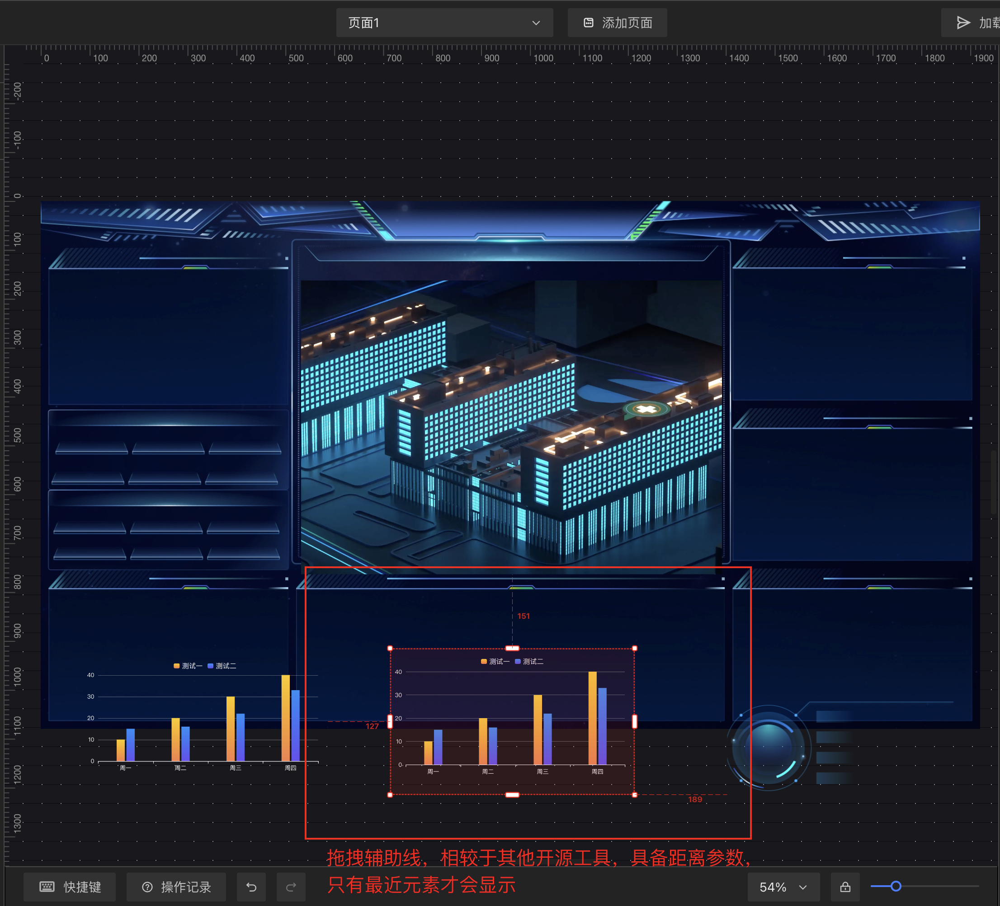

# low-code 可视化大屏编辑器

预览地址: http://39.106.20.75/#/login (直接登陆即可)

## Recommended IDE Setup

[VSCode](https://code.visualstudio.com/) + [Volar](https://marketplace.visualstudio.com/items?itemName=Vue.volar) (and disable Vetur).

## Type Support for `.vue` Imports in TS

TypeScript cannot handle type information for `.vue` imports by default, so we replace the `tsc` CLI with `vue-tsc` for type checking. In editors, we need [Volar](https://marketplace.visualstudio.com/items?itemName=Vue.volar) to make the TypeScript language service aware of `.vue` types.

## Customize configuration

See [Vite Configuration Reference](https://vite.dev/config/).

## Project Setup

```sh
pnpm install
```

### Compile and Hot-Reload for Development

```sh
pnpm dev
```

### Type-Check, Compile and Minify for Production

```sh
pnpm build
```

## 用户指引
    1.整体概览


    2.辅助线功能


    3.操作记录


    4.快捷键


    5.图层管理


    6.变量管理


    7.接口数据源管理


    8.组件属性配置，变量如何绑定


    9.自定义配置组件属性


    10.组件样式管理

    
    11.组件高级设置，绑定事件

